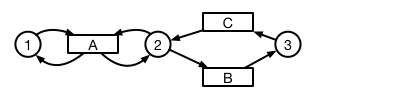
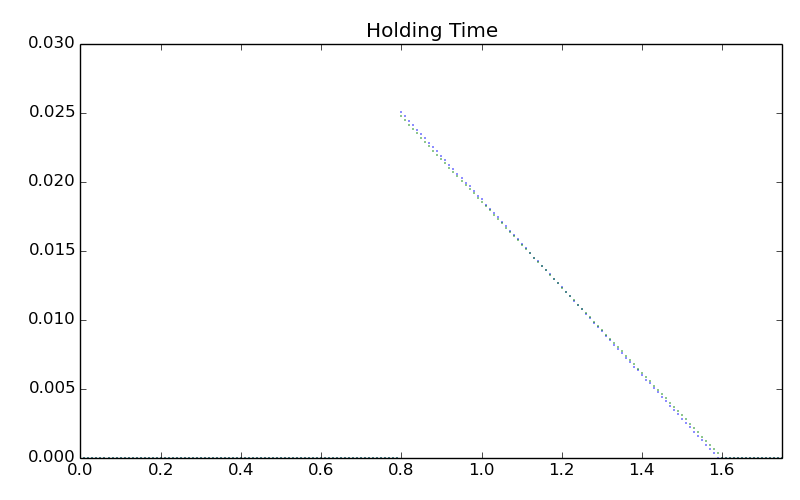

# Discrete Next Reaction

This project tests whether discrete-time simulations need to
use a discrete-time version of Gibson and Bruck's Next Reaction algorithm.

## Next Reaction Algorithm

In continuous-time, discrete space, stochastic modeling, there
is a family of simulation algorithms which sample each transition
to see which is next to fire. The conceptual algorithm is that the next one
to fire is the soonest of all of those sampled. After one fires, all
of them are sampled again.

Gibson and Bruck devised an algorithm by which to avoid sampling every
transition at every time step. The core observation is that a
set of samples from an exponential distribution remains exponentially-distributed
after removing the soonest sample. In that case, the other samples
can be kept after the last one fires. The technique, therefore,
is to treat each transition as a renewal process whose variable is sampled
using a random variable transformation from an exponential distribution.
The net result is that most pseudorandom samples can be retained,
decreasing order of computation manifold.

The question in this project is whether discrete time calculations
require the same care, so we put two algorithms head-to-head 
for a model where transitions are disabled and then reenabled.
It is only these models where the Next Reaction algorithm matters
for continuous time.

## Simulation of Susceptible-Infectious-Susceptible

We take N=10 individuals who progress from susceptible to
infectious and back again. Infectious individuals infect susceptibles,
and every individual is a neighbor of every other, so this is well-mixed.


## The algorithms

Here is pseudocode for the two sampling algorithms in sample.py.

The equivalent of a first reaction code:

```Python
for time_idx in range(time_cnt):
    for transition_name, transition in model.EnabledTransitions():
        if transition.Fire(time_idx, rng):
            model.FireAndUpdate(transition_name)
```

The next reaction code can work with a priority queue:

```Python
now=0
while not queue.Empty():
    now, transition=queue.top()
    enabled, disabled=model.FireAndUpdate(transition)
    for en_transition in enabled:
    	queue.append((en_transition.FiringTime(now, rng), en_transition))
    for dis_transition in disabled:
    	queue.remove(dis_transition.queue_entry)
```

There is an additional wrinkle that recovery or infection can
happen for the same individual at the same time. That could be solved
using a master equation approach, as described in Molloy 1985, but
that approach won't work for a Next Equation method, that I know of,
so we decide infections happen before recoveries (or, rather, transitions
back to susceptible), but we also choose a very small time step so
that this is quite rare.

## The Interruption Model

This is the simplest chemical reaction where one transition interrupts
another one. One transition just wants to keep firing, but it needs
its neighbor's token. The neighbor, however, will sometimes fire
so that it leaves for a moment, and then fire to return. We watch
the density of firing times for the first transition, given that
it is being interrupted.



The actualy model used has two A transitions and two B transitions. The
multiple A transitions don't seem to compete. The multiple B transitions
are the ones that show this error.
The net result of the model is that one of the transitions fires
48.9% ± 1e-4% of the time for one simulation, and the other fires 50.1%
± 1e-4% of the time. Doesn't sound like a lot, but I feel like I haven't
optimized to find bias in the simulations.



It looks like a slight difference in slopes.

## An Explanation

Gibson and Bruck show that the distribution of samples from their algorithm
agrees with the distribution of samples from Gilespie's First Reaction algorithm,
so they don't have to do any more than that to show correctness. I'm curious
about how incorrect an incorrect algorithm can be, so how do we pose
that question? I don't have an answer, but I have two clues.

Gibson and Bruck's paper suggests that the problem with keeping
samples from previous time steps is that those samples which
are re-sampled, instead of being recomputed using a random variable
transformation, will bias the distribution of the set of draws. The
only way for bias to happen in this algorithm is at the moment
of a transition, when firing a transition affects other transitions'
rates or whether they are enabled.

The second clue comes from our current understanding of the Next
Reaction algorithm, as explained in papers by Anderson. He
looks at it as a statistical process on competing renewal
processes. These renewal processes carry state separate from
the location of tokens in the graph and separate from the
enabling time. That state is the amount of "time" remaining
in the exponential distributions from which samples are taken.
Bias from resampling distributions of transitions is equivalent
to resetting the clocks of these renewal processes, and resetting
them at times which are correlated.

We therefore expect maximal error in the simple, flawed, priority-draw
algorithm when the stochastic matrix for the system is 
sensitive to resetting renewal processes for transitions which
depend on other transitions. What I need to do is to set up a
system where this is clearer and where I can calculate the
difference theoretically.
